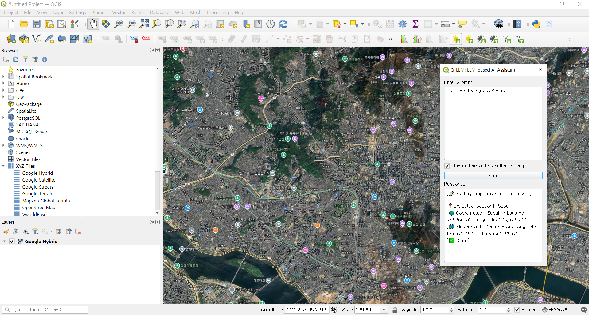

# Q-LLM: QGIS Plugin for Gemma 3 LLM Integration

Q-LLM is a QGIS plugin that enables users to interact with the Gemma 3 LLM and automate map movement using simple prompts. The plugin provides two main features:
1. **Dialogue with Gemma 3 LLM** - Users can ask questions directly in QGIS and get responses from the Gemma 3 model.
2. **Automated Map Movement** - By providing location-based prompts, users can automatically move the map to a specified location.

## Features

- **Prompt Input**: Simple text box for entering prompts.
- **Response Output**: Displays the response from Gemma 3 LLM in a read-only text box.
- **Ask Button**: Executes the interaction with Gemma 3 LLM.
- **Move Map**: Allows users to move the map based on the provided location in the prompt.

## Installation

Before installing the Q-LLM plugin, make sure you have the **Gemma 3 model** installed via **Ollama**. The plugin interacts with the Gemma 3 model to provide the key functionalities.

### Step 1: Install Gemma 3 Model with Ollama

1. Download and install **Ollama** from the official website: [https://ollama.com](https://ollama.com).
2. After installing Ollama, you will need to install the **Gemma 3 model** using the following command:

   ```bash
   ollama pull gemma3
   ```

3. Ensure that the model is correctly installed and accessible by Ollama.

### Step 2: Install Q-LLM Plugin in QGIS

1. Download the plugin ZIP file.
2. In QGIS, go to **Plugins** > **Manage and Install Plugins...**
3. Click on the **Install from ZIP** button.
4. Select the downloaded ZIP file and install the plugin.
5. Restart QGIS, and the Q-LLM plugin will be available in the Plugin toolbar.

### Step 3: Using Q-LLM Plugin

Once the installation is complete and the Gemma 3 model is running via Ollama, you can use the Q-LLM plugin as described in the **Usage** section.

## Example

In the screenshot below, you can see two example interactions:

1. **Prompt**: "What is QGIS?"
   - **Response**: "QGIS is a free and open-source geographic information system (GIS) that supports a wide range of vector, raster, and database formats. It is used for mapping and spatial data analysis."

2. **Prompt**: "Move to Seoul!"
   - **Response**: "Seoul has been extracted as the location. The map will now center on Seoul."



## Requirements

- QGIS 3.x or above
- Python 3.x

## Contributing

Feel free to fork the repository and submit pull requests. Contributions are welcome!

## License

This project is licensed under the MIT License - see the [LICENSE.md](LICENSE.md) file for details.
